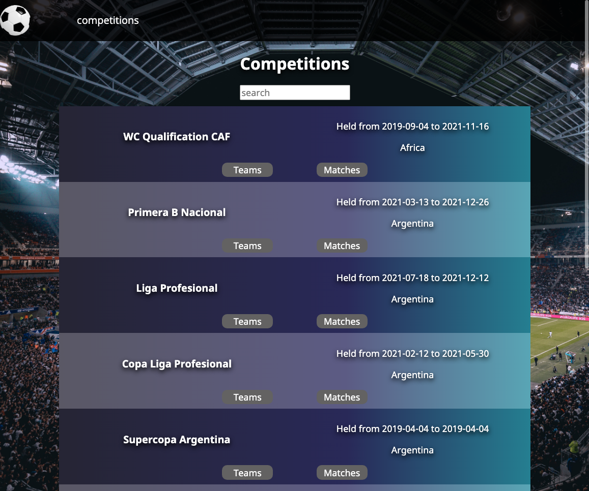
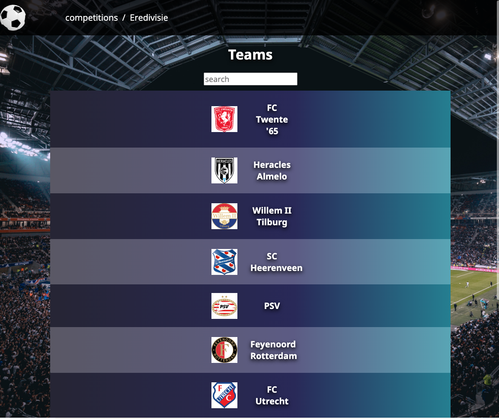
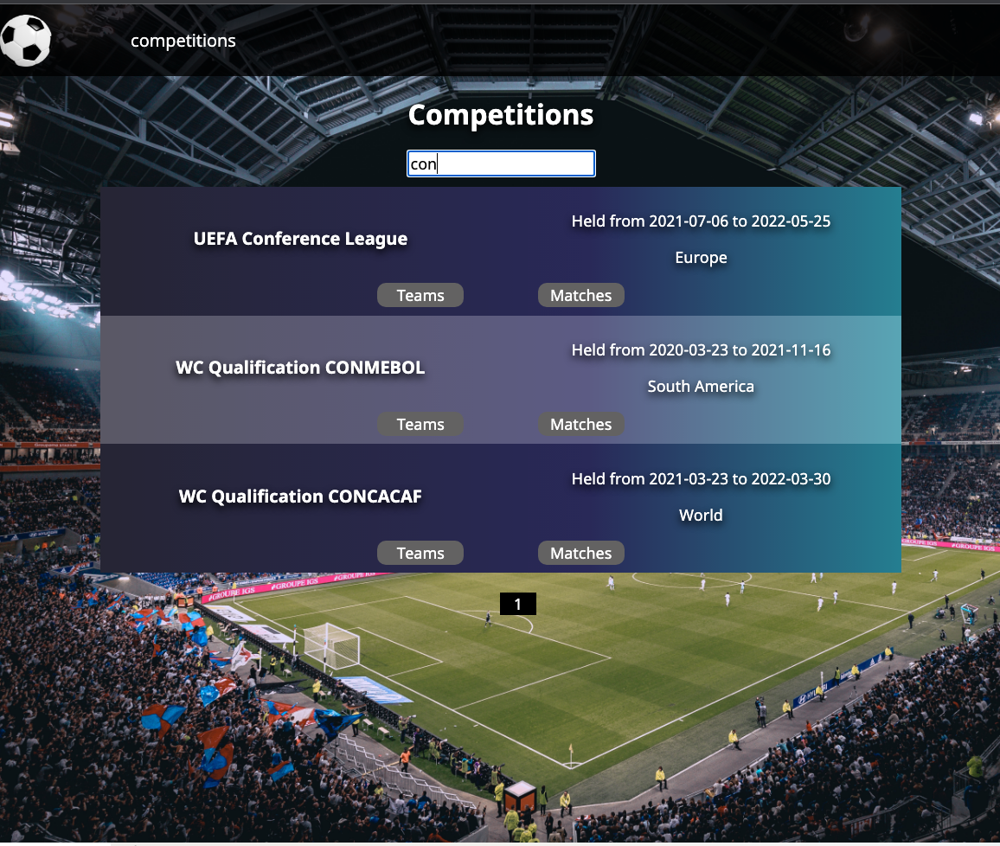
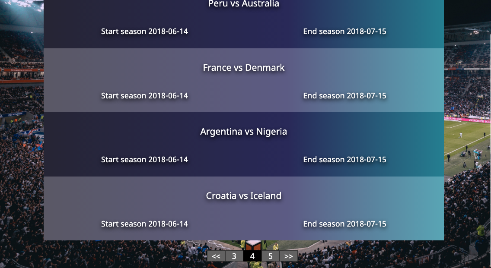
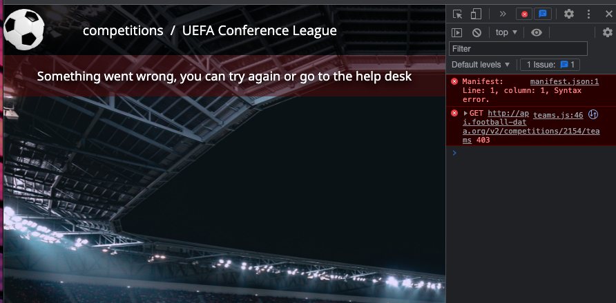
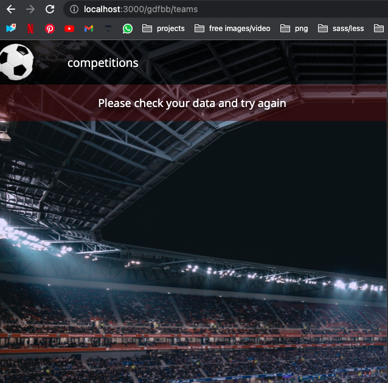

On this site you can view European football competitions, teams and matches.

Pages have pagination, filter by nam, react-router-dom (get-request is displayed in the address bar)

<h2>Screenshots</h2>

<ol>
    <li>Main page with competitions:
        <ul>
            <li>
                
            </li>
        </ul>
    </li>
    <li>Page with teams
        <ul>
            <li>
                
            </li>
        </ul>
    </li>
    <li>Filter by name of contest/team
        <ul>
            <li>
                
            </li>
        </ul>
    </li>
     <li>Pagination
        <ul>
            <li>
                
            </li>
        </ul>
    </li>
    <li>Error 403 Forbidden
        <ul>
            <li>
                
            </li>
        </ul>
    </li>
        <li>Bad request
        <ul>
            <li>
                
            </li>
        </ul>
    </li>
</ol>